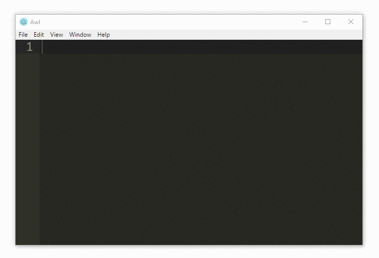

Awl
===

A calculator built on a text-editor, ideal for programmers.

  

You have to build the exceutable yourself - see [this page](docs/workflow.md).

Idea
----

The main idea behind the app is to make a calculator, that truly fits its domain - a desktop PC.

- Why should a calculator have buttons, when you have keyboard underneath your hands?
- Why can't I type entire expressions, but instead have to do the chaining nonsense?
- Why use memory like <kbd>M+</kbd>, instead of this `x = 42`?

These are some of the design influencing factors:

- easily recall values from past calculations and make <kbd>Ctrl + C</kbd> a breeze `=>` make it text-editor based
- perform atleast some symbolic calculations
- keep mathematical notation (`2x` for `2*x`), but make impossible squiggles easier to write (`3 // 27` for `nthroot(3, 27)`)
- but most importantly, make a calcualtor, that's actually fun to use

Current state
-------------

Awl is currently just a simple proof of concept. Give me some time, and I'll implement more features and write some docs.

Glued together from
-------------------

- [Electron](https://electron.atom.io/)
- [Ace](https://ace.c9.io/)
- [math.js](http://mathjs.org/)
- [nearley.js](https://nearley.js.org/)